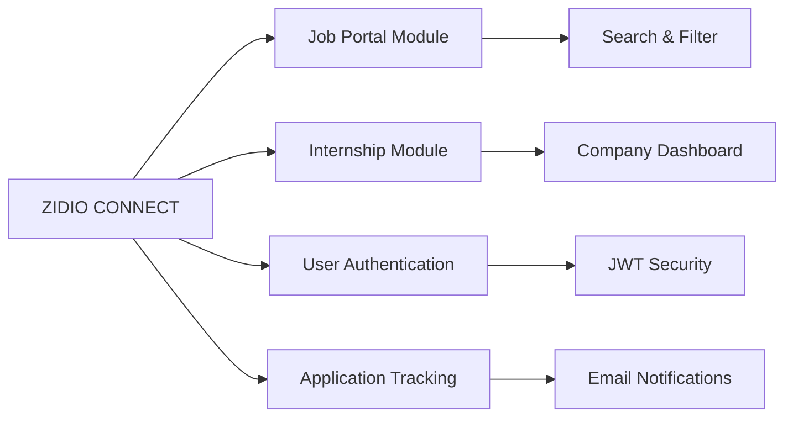

<div align="center">
  
</div>

<div align="center">
  
</div>

<p align="center">
  
  
  
</p>

---

## 🚀 About Me

```javascript
const rupam = {
    location: "Bengaluru, Karnataka, IN",
    role: "Java Full Stack Developer",
    currentFocus: "Building ZIDIO CONNECT - Job & Internship Portal",
    learning: ["Advanced Spring Boot", "React.js", "System Design", "Microservices"],
    experience: "Ex-Intern @ Zidio Development",
    interests: ["Backend Architecture", "RESTful APIs", "Database Optimization"],
    funFact: "I believe great code is like poetry - elegant, purposeful, and timeless",
    lifePhilosophy: "Build solutions that make a difference"
};
```

<div align="center">

### 🎯 Current Mission
**Developing ZIDIO CONNECT** - A comprehensive job and internship portal connecting talented individuals with opportunities

</div>

---

## 💼 Technical Arsenal

<div align="center">

### Languages


### Frameworks & Libraries


### Databases


### Tools & Technologies


### API & Security


</div>

---

## 📊 GitHub Analytics

<div align="center">
  
  
</div>

<div align="center">
  
  
</div>

<div align="center">
  
</div>

---

## 🏆 GitHub Trophies

<div align="center">
  
</div>

---

## 🐍 Contribution Graph

<div align="center">
  
</div>

---

## 🎓 Experience & Achievements

<table align="center">
  <tr>
    <td align="center" width="50%">
      
      <br><strong>Ex-Intern @ Zidio Development</strong>
      <br><sub>Gained hands-on experience in full-stack development</sub>
    </td>
    <td align="center" width="50%">
      
      <br><strong>ZIDIO CONNECT Project</strong>
      <br><sub>Leading development of comprehensive job portal</sub>
    </td>
  </tr>
</table>

---

## 📫 Let's Connect

<div align="center">
  
[](mailto:work.rupam.giri@gmail.com)
[](https://www.linkedin.com/in/rupam-giri-087b00348/)
[](https://Rupam797.github.io)
[](https://github.com/Rupam797)

</div>

---

## 💡 What I'm Working On

<div align="center">



</div>

---

## 📈 Coding Activity

<!--START_SECTION:waka-->
<!--END_SECTION:waka-->

<div align="center">
  
</div>

---

## 🎯 2025 Goals

- ✅ Master Spring Boot Microservices Architecture
- ✅ Contribute to Open Source Projects
- ✅ Build Production-Ready Full Stack Applications
- ✅ Learn DevOps & Cloud Technologies (AWS/Azure)
- ✅ Improve System Design Skills
- ✅ Share Knowledge through Technical Blogs

---

## 💭 Dev Quote

<div align="center">
  
</div>

---

## 🎵 Spotify Playing

<div align="center">
  
</div>

---

<div align="center">
  
### 💼 Open for Collaboration & Opportunities
  
*"The best way to predict the future is to create it"*


</div>

---

<div align="center">
  <sub>⭐ From <a href="https://github.com/Rupam797">Rupam Giri</a> | Made with ❤️ and ☕</sub>
</div>
